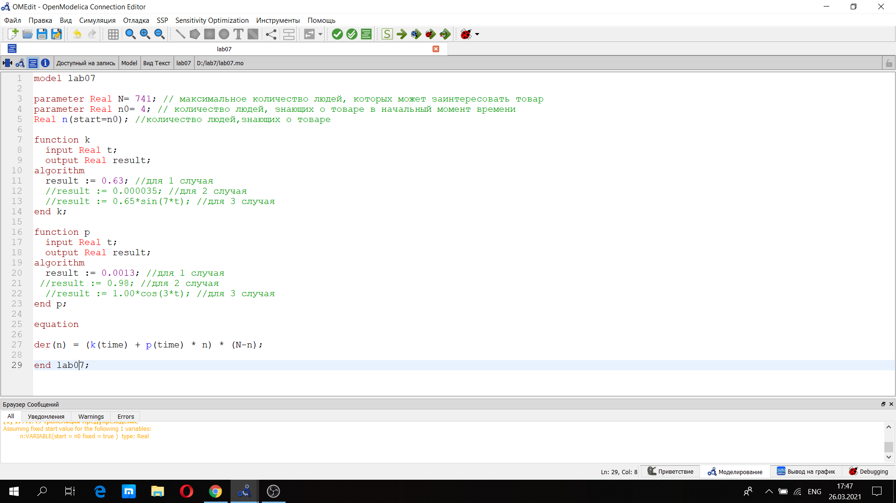
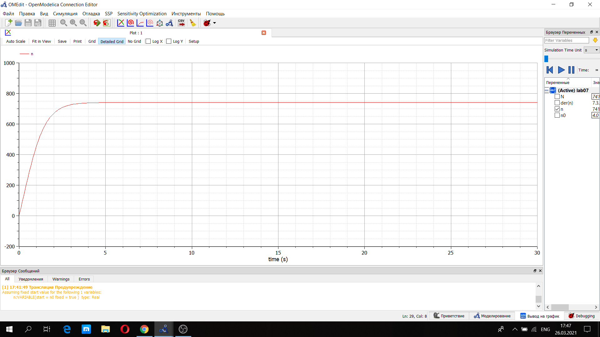
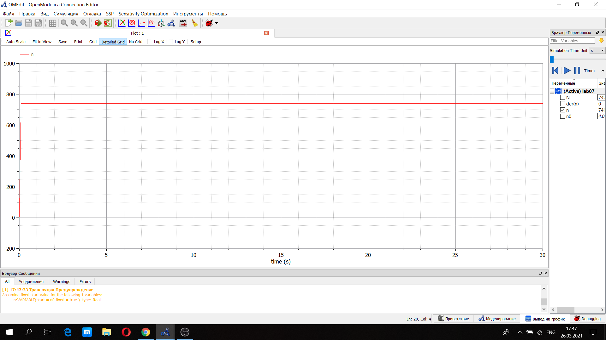
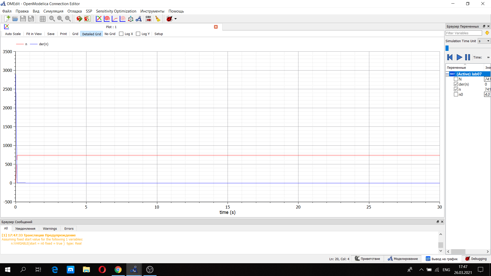

---
# Front matter
lang: ru-RU
title: "Лабораторная работа №7"
author: "Селезнев Василий Александрович"

# Formatting
toc-title: "Содержание"
toc: true # Table of contents
toc_depth: 2
lof: true # List of figures
lot: true # List of tables
fontsize: 12pt
linestretch: 1.5
papersize: a4paper
documentclass: scrreprt
polyglossia-lang: russian
polyglossia-otherlangs: english
mainfont: PT Serif
romanfont: PT Serif
sansfont: PT Sans
monofont: PT Mono
mainfontoptions: Ligatures=TeX
romanfontoptions: Ligatures=TeX
sansfontoptions: Ligatures=TeX,Scale=MatchLowercase
monofontoptions: Scale=MatchLowercase
indent: true
pdf-engine: lualatex
header-includes:
  - \linepenalty=10 # the penalty added to the badness of each line within a paragraph (no associated penalty node) Increasing the value makes tex try to have fewer lines in the paragraph.
  - \interlinepenalty=0 # value of the penalty (node) added after each line of a paragraph.
  - \hyphenpenalty=50 # the penalty for line breaking at an automatically inserted hyphen
  - \exhyphenpenalty=50 # the penalty for line breaking at an explicit hyphen
  - \binoppenalty=700 # the penalty for breaking a line at a binary operator
  - \relpenalty=500 # the penalty for breaking a line at a relation
  - \clubpenalty=150 # extra penalty for breaking after first line of a paragraph
  - \widowpenalty=150 # extra penalty for breaking before last line of a paragraph
  - \displaywidowpenalty=50 # extra penalty for breaking before last line before a display math
  - \brokenpenalty=100 # extra penalty for page breaking after a hyphenated line
  - \predisplaypenalty=10000 # penalty for breaking before a display
  - \postdisplaypenalty=0 # penalty for breaking after a display
  - \floatingpenalty = 20000 # penalty for splitting an insertion (can only be split footnote in standard LaTeX)
  - \raggedbottom # or \flushbottom
  - \usepackage{float} # keep figures where there are in the text
  - \floatplacement{figure}{H} # keep figures where there are in the text
---

# Цель работы

Познакомиться с моделью Мальтуса и моделью логистической кривой на примере рекламной компании и построить ее, используя язык программирования Modelica.

# Задание

1. Построить график распространения рекламы для первого случая
2. Построить график распространения рекламы для второго случая 
Для этого случая определить, в какой момент времени скорость распространения рекламы будет максимальной.
3. Построить график распространения рекламы для третьего случая.

# Выполнение лабораторной работы

После запуска рекламных объявлений скорость изменения числа знающих о продукции людей пропорциональна как числу знающих о товаре покупателей, так и числу покупателей о нем не знающих. 

Известны начальные данные: N = 741 - объем аудитории, n~0~ = 4 - число людей, знакомых с рекламой в начальный момент времени.

Ниже представлен скриншот кода программы, написанный на языке программирования Modelica. (рис 1. -@fig:001)  

{ #fig:001 width=70% }  

Представлен график распространения рекламы для первого случая. (рис 2. -@fig:001)  

{ #fig:001 width=70% }  

Также представлен график распространения рекламы для второго случая. (рис 3. -@fig:001)  

{ #fig:001 width=70% }    

Представлен график распространения скорости распространения рекламы для второго случая. (рис 4. -@fig:001)  

{ #fig:001 width=70% }   

Представлен график распространения рекламы для третьего случая. (рис 5. -@fig:001)  

{ #fig:001 width=70% }  

# Выводы

Я ознакомился с моделью Мальтуса и моделью логистической кривой на примере эффективности рекламы. Построил для них графики, используя язык программирования Modelica.
